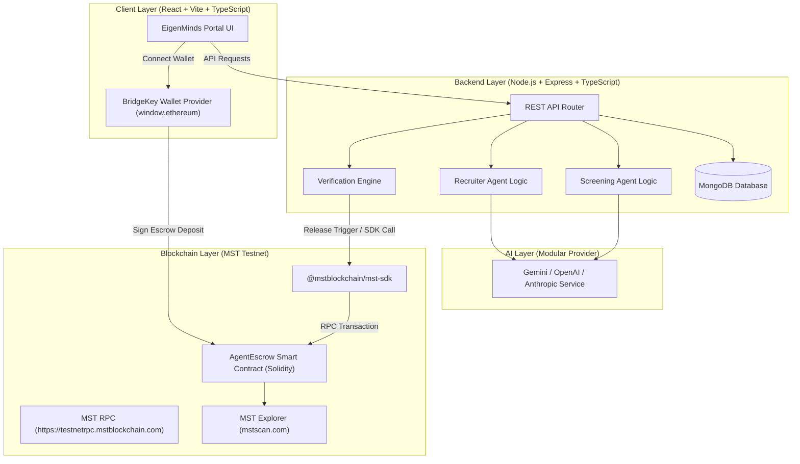

# 1. Project Overview

**EigenMinds** is an AI Agent-to-Agent Commerce and Programmable Blockchain Settlement platform designed for the MST Blockchain Hackathon.

In this platform:
* A **Recruiter Agent** (buyer) requires candidate screening services for a job specification.
* A specialized **Screening Agent** (seller) evaluates synthetic resumes against the specification for an agreed fee in `MSTC` tokens.
* The workflow combines **Off-Chain AI Execution** (resume parsing, candidate ranking, requirement matching) with **On-Chain Programmable Settlement** (escrow creation, locking funds, verifiable payment release) on the **MST Testnet**.

---

# 2. Problem Statement

Autonomous AI agents need standard, verifiable, trustless mechanisms to negotiate service contracts, lock funds in escrow, execute domain-specific tasks off-chain (such as resume screening), verify results, and automatically release crypto payments on-chain upon successful completion without human intervention or centralized payment processors.

---

# 3. Demo Scenario

1. **Role Specification Creation**: The Recruiter Agent receives a hiring request (e.g., Backend Engineer requiring Node.js, Express, MongoDB, REST APIs, 2+ years experience).
2. **Agent Discovery**: The Recruiter Agent queries available specialized Screening Agents and compares their capabilities and quoted prices (e.g., 1.0 MSTC per screening batch).
3. **Agreement & Escrow**: The Recruiter Agent creates an on-chain escrow agreement on MST Testnet and funds it with 1.0 MSTC.
4. **Off-Chain Execution**: The Recruiter Agent passes a dataset of synthetic resumes and the role specification to the selected Screening Agent.
5. **Assessment Report**: The Screening Agent processes the batch, generates structured evaluation scores, candidate rankings, and key match insights.
6. **Result Verification**: The Recruiter Agent / Verification module validates that the screening report satisfies the agreed criteria.
7. **On-Chain Settlement**: Upon successful validation, the Escrow Smart Contract releases the 1.0 MSTC payment directly to the Screening Agent's public wallet address.
8. **UI & Explorer Transparency**: The human operator views the full interaction log in the UI, alongside verifiable transaction hashes linked to `mstscan.com`.

---

# 4. Core Actors

* **Recruiter Agent (Buyer Agent)**: Formulates hiring criteria, discovers service providers, initiates on-chain escrows, delivers inputs, and verifies outputs.
* **Screening Agent (Seller Agent)**: Autonomous AI agent specialized in evaluating candidate resumes against job specifications.
* **Verification Module / Agent**: Validates output formatting, completeness, and match quality before payment release.
* **Human User / Operator**: Human manager initiating the workflow, providing wallet authorization via BridgeKey extension, and monitoring agent interaction.
* **MST Escrow Smart Contract**: Smart contract deployed on MST Testnet managing state transitions (`Created` -> `Funded` -> `Completed` / `Refunded`) and token custody.

---

# 5. Core Workflow

```
[Recruiter Agent] ---> (1) Job Spec & Synthetic Resumes (OFF-CHAIN)
       |
       v
[Screening Agent] ---> (2) Service Discovery & Quote (OFF-CHAIN)
       |
       v
[MST Escrow Contract] <--- (3) Create & Fund Escrow (ON-CHAIN: MST Testnet)
       |
       v
[Screening Agent] ---> (4) Execute Screening & Deliver Report (OFF-CHAIN)
       |
       v
[Verification Module] ---> (5) Verify Assessment Format & Criteria (OFF-CHAIN)
       |
       v
[MST Escrow Contract] <--- (6) Trigger Payout to Seller Wallet (ON-CHAIN: MST Testnet)
       |
       v
[MST Explorer / UI] ---> (7) Display Verified Tx Hash on mstscan.com (ON-CHAIN)
```

### Detailed Breakdown:
* **OFF-CHAIN**: Candidate resumes, job requirements, agent system prompts, raw LLM outputs, candidate ranking reports, JSON schema validation.
* **ON-CHAIN**: Escrow agreement ID creation, token locking, completion/release signal, seller payout, transaction history verification on MST Testnet.

---

# 6. Architecture



---

# 7. Technology Stack

* **Node.js**: `v24.13.0`
* **NPM**: `11.6.2`
* **Frontend**: React `18.3.1`, Vite `6.0.7`, TypeScript `5.7.2`, Lucide React `0.469.0`
* **Backend**: Express `4.21.2`, TypeScript `5.7.2`, Mongoose `8.9.3`
* **Database**: MongoDB (Local/Atlas connection)
* **Smart Contracts**: Hardhat `2.22.18`, Solidity `0.8.20`, Ethers.js `v6.13.5`
* **MST Tooling**: `@mstblockchain/mst-sdk` `v1.0.0`, `@mstblockchain/mst-vibe-kit` `v0.1.1`
* **Network**: MST Testnet (Chain ID: `91562037` [Verified Live RPC, historically documented as `4545`], RPC: `https://testnetrpc.mstblockchain.com`, Currency: `MSTC`)

---

# 8. Repository Structure

```
EigenMinds/
├── .env.example                # Blueprint for environment variables
├── .gitignore                  # Git exclusions (protecting secrets and build output)
├── package.json                # Root orchestration package
├── PROJECT_CONTEXT.md          # Persistent source of truth context file
├── client/                     # Frontend Application (React + Vite + TS)
│   ├── index.html
│   ├── package.json
│   ├── tsconfig.json
│   ├── vite.config.ts
│   └── src/
│       ├── App.tsx
│       ├── index.css
│       └── main.tsx
├── server/                     # Backend Application (Express + TS + Mongoose)
│   ├── package.json
│   ├── tsconfig.json
│   └── src/
│       ├── index.ts            # Server entry point & DB initialization
│       ├── config/
│       │   └── db.ts           # Mongoose DB connection & graceful fallback
│       ├── controllers/
│       │   ├── agentController.ts
│       │   ├── escrowController.ts
│       │   ├── jobController.ts
│       │   └── screeningController.ts
│       ├── data/
│       │   ├── seedAgents.ts    # Seed data for Recruiter & Screening agents
│       │   ├── seedDatabase.ts  # Database initialization seeder
│       │   └── syntheticResumes.ts # 5 varied synthetic candidate resumes
│       ├── models/
│       │   ├── Agent.ts
│       │   ├── EscrowAgreement.ts
│       │   ├── JobRequirement.ts
│       │   └── ScreeningTask.ts
│       ├── routes/
│       │   └── api.ts          # Express REST API Router
│       ├── services/
│       │   ├── agents/
│       │   │   ├── RecruiterAgentService.ts
│       │   │   └── ScreeningAgentService.ts
│       │   ├── ai/
│       │   │   └── aiProvider.ts   # Modular AI Provider & deterministic fallback
│       │   ├── blockchain/
│       │   │   └── blockchainService.ts # Boundary returning NOT_CONFIGURED safely
│       │   ├── screening/
│       │   │   └── screeningEngine.ts # Deterministic baseline evaluation engine
│       │   └── verification/
│       │       └── verificationEngine.ts # 10-rule off-chain verification engine
│       ├── tests/
│       │   └── runTests.ts     # Business logic unit & integration test runner
│       └── types/
│           ├── agent.ts
│           ├── escrow.ts
│           ├── job.ts
│           ├── resume.ts
│           └── screening.ts
└── contracts/                  # Smart Contract Workspace (Hardhat + Solidity)
    ├── hardhat.config.js
    ├── package.json
    ├── contracts/
    │   └── AgentEscrow.sol    # Solidity 0.8.20 MST Escrow contract
    ├── scripts/
    │   └── deploy.js          # Hardhat deployment script for MST Testnet
    └── test/
        └── AgentEscrow.test.js # 18 unit tests for AgentEscrow.sol
```

---

# 9. Environment Variables

### Root / Backend Variables (`.env`):
* `PORT`: Server listening port (default `5000`)
* `NODE_ENV`: Application environment (`development` / `production`)
* `MONGODB_URI`: MongoDB connection string (default `mongodb://localhost:27017/eigenminds`)
* `SCREENING_MODE`: Screening engine mode (`deterministic` | `llm`, default `deterministic`)
* `OPENAI_API_KEY`: API key for OpenAI LLM services (optional)
* `GEMINI_API_KEY`: API key for Gemini LLM services (optional)
* `ANTHROPIC_API_KEY`: API key for Anthropic LLM services (optional)
* `MST_RELAY_PRIVATE_KEY`: Testnet-only relay signer private key for automated verification release (optional for local dev)

### Client Variables (`client/.env`):
* `VITE_API_BASE_URL`: Backend API endpoint (`http://localhost:5000/api`)
* `VITE_MST_NETWORK_NAME`: MST Testnet
* `VITE_MST_RPC_URL`: `https://testnetrpc.mstblockchain.com`
* `VITE_MST_CHAIN_ID`: `91562037`
* `VITE_MST_ESCROW_CONTRACT_ADDRESS`: Address of deployed `AgentEscrow` contract
* `VITE_MST_FAUCET_URL`: `https://faucet.masterstroke.academy`
* `VITE_MST_EXPLORER_URL`: `https://mstscan.com`

*SECURITY MANDATE*: No private keys or secret credentials will EVER be stored in frontend code, checked into Git, or written in `PROJECT_CONTEXT.md`.

---

# 10. Database Models

### 1. `Agent`
* `agentId`: String (Unique index)
* `name`: String
* `role`: String ("RECRUITER" | "SCREENER")
* `description`: String
* `walletAddress`: String (PUBLIC MST wallet address only)
* `capabilities`: Array of Strings
* `pricePerTask`: Number (in MSTC)
* `currency`: String ("MSTC")
* `rating`: Number
* `status`: String ("ACTIVE" | "INACTIVE")
* `metadata`: Object

### 2. `JobRequirement`
* `jobId`: String (Unique index)
* `title`: String
* `description`: String
* `requiredSkills`: Array of Strings
* `preferredSkills`: Array of Strings
* `minExperienceYears`: Number
* `evaluationCriteria`: `{ skillMatchWeight: Number, experienceWeight: Number, requiredSkillPenalty: Number, recommendationThreshold: Number }`

### 3. `EscrowAgreement`
* `agreementId`: String (Unique index)
* `jobId`: String
* `recruiterAgentId`: String
* `screeningAgentId`: String
* `recruiterWallet`: String
* `sellerWallet`: String
* `amountMSTC`: Number
* `status`: String ("CREATED", "FUNDED", "IN_PROGRESS", "VERIFIED", "RELEASED", "REFUNDED")
* `onChainEscrowId`: Number / String / null
* `contractAddress`: String / null
* `fundingTxHash`: String / null
* `releaseTxHash`: String / null
* `refundTxHash`: String / null

### 4. `ScreeningTask`
* `taskId`: String (Unique index)
* `agreementId`: String
* `jobId`: String
* `screeningAgentId`: String
* `resumesCount`: Number
* `status`: String ("PENDING", "PROCESSING", "COMPLETED", "VERIFIED", "FAILED")
* `inputSnapshot`: `{ jobTitle: String, requiredSkills: String[], resumes: SyntheticResume[] }`
* `assessmentResult`: `{ evaluatedCount: Number, rankings: ICandidateEvaluation[], summary: String }`
* `verificationResult`: `{ verified: Boolean, checks: Object, issues: String[] }`
* `completedAt`: Date

---

# 11. API Endpoints

* `GET /api/health` — Returns backend health status, timestamp, and blockchain boundary configuration
* `GET /api/resumes/seed` — Returns pre-configured 5 synthetic candidate resumes
* `GET /api/agents` — Returns list of active Recruiter and Screening Agents
* `POST /api/agents/discover` — Matches JobRequirement against screening agent capabilities and quotes
* `POST /api/jobs` — Creates a new JobRequirement record
* `GET /api/jobs/:jobId` — Fetches JobRequirement by ID
* `POST /api/agreements` — Registers a new off-chain EscrowAgreement record (`status: CREATED`)
* `GET /api/agreements/:agreementId` — Fetches EscrowAgreement details and current blockchain sync status
* `POST /api/screening/submit` — Executes Screening Agent evaluation on synthetic resume batch
* `POST /api/screening/verify` — Runs Verification Engine against task output and updates agreement state to `VERIFIED`

---

# 12. Agent Contracts / Interfaces

### Recruiter Agent Discovery Request Interface:
```json
{
  "jobId": "JOB-BACKEND-01",
  "title": "Backend Engineer",
  "requiredSkills": ["Node.js", "Express", "MongoDB", "REST APIs"],
  "preferredSkills": ["TypeScript", "Docker"],
  "minExperienceYears": 2
}
```

### Screening Task Output Interface:
```json
{
  "taskId": "TASK-1727543820-123",
  "evaluatedCount": 5,
  "rankings": [
    {
      "candidateId": "CAND-001",
      "candidateName": "Alex Mercer (Strong Match)",
      "matchScore": 100,
      "recommendation": "HIRE",
      "keyStrengths": ["Matched 4/4 required skills", "Experience: 4 yrs meets required 2 yrs"],
      "missingSkills": [],
      "experienceAssessment": "4 year(s) meets or exceeds minimum requirement of 2 year(s)."
    },
    {
      "candidateId": "CAND-002",
      "candidateName": "Blake Taylor (Partial Match)",
      "matchScore": 75,
      "recommendation": "CONSIDER",
      "keyStrengths": ["Matched 3/4 required skills"],
      "missingSkills": ["MongoDB"],
      "experienceAssessment": "3 year(s) meets or exceeds minimum requirement of 2 year(s)."
    }
  ],
  "summary": "5 candidate(s) evaluated against role 'Backend Engineer'. 1 recommended for HIRE, 2 for CONSIDERation."
}
```

### Verification Engine Result Interface:
```json
{
  "verified": true,
  "checks": {
    "complete": true,
    "schemaValid": true,
    "scoresValid": true,
    "allCandidatesEvaluated": true
  },
  "issues": []
}
```

---

# 13. MST Integration

* **Network**: MST Testnet
* **Chain ID**: `91562037` (Verified Live RPC; historically documented as `4545`)
* **RPC URL**: `https://testnetrpc.mstblockchain.com`
* **Currency Symbol**: `MSTC`
* **Faucet URL**: `https://faucet.masterstroke.academy` (10 MSTC per faucet request)
* **Explorer**: `https://mstscan.com`
* **SDK**: `@mstblockchain/mst-sdk` (v1.0.0) wrapping Ethers v6

### Human Prerequisites Checklist:
1. Install BridgeKey Extension (`https://chromewebstore.google.com/detail/bridgekey/bfjojdcfenehemjgjlepdjomkpginlkg`)
2. Create/Import BridgeKey Wallet & Select MST Testnet.
3. Copy Public Address (Recorded in `PROJECT_CONTEXT.md` once provided by team).
4. Request Testnet MSTC from Faucet (`https://faucet.masterstroke.academy`).
5. Confirm balance receipt before live testnet deployment.

### Current MST Status:
* Public Deployment Wallet: `<PENDING HUMAN SETUP ENTRY>`
* Faucet Status: `UNKNOWN`
* Approximate Testnet Balance: `0 MSTC`
* Deployment Status: `DEPLOYMENT PENDING HUMAN / ENVIRONMENT SETUP` (Deployment script `contracts/scripts/deploy.js` ready for execution upon wallet funding).
* Off-Chain Service Status: `BlockchainService` boundary active, safely returning `NOT_CONFIGURED` without fabricating transaction hashes.

---

# 14. Smart Contracts

### Contract Implemented: `AgentEscrow.sol`
* **File**: `contracts/contracts/AgentEscrow.sol`
* **Compiler**: Solidity `^0.8.20` (EVM target: Paris)
* **Dependencies**: Zero external dependencies (custom inline `nonReentrant` state guard).
* **Purpose**: Holds native `MSTC` tokens in escrow for recruiter/screening agent agreements until screening outputs are validated off-chain.
* **Status**: **COMPILED & 100% UNIT TESTED (18/18 Tests Passing)**.

---

# 15. Completed Phases

* **Phase 0 — COMPLETE**: Project initialization, environment check, wallet architecture decision, repository scaffolding, `.gitignore`/`.env.example` setup, `PROJECT_CONTEXT.md` creation.
* **Phase 1 — COMPLETE**: Smart contract development (`AgentEscrow.sol`), custom reentrancy protection, unit test suite (18/18 passing), deployment script (`contracts/scripts/deploy.js`), MST verification.
* **Phase 2 — COMPLETE**: Off-chain backend foundation (Express + Mongoose + TypeScript), domain models (`Agent`, `JobRequirement`, `EscrowAgreement`, `ScreeningTask`), synthetic resume dataset, `DeterministicScreeningEngine`, modular `AIProvider`, 10-rule `VerificationEngine`, `BlockchainService` boundary, REST API endpoints, 13 business-logic tests passing.
* **Phase 3 — COMPLETE**: Frontend Application (React + Vite + Glassmorphism UI), Agent Portal, Web3 BridgeKey wallet connection, live MST Escrow funding & settlement integration. 7-step interactive workflow stepper operational, fully typechecked and verified.

---

# 16. Implementation History

### 2026-09-28 — Phase 0: Project Initialization & Architectural Blueprint
* **Objective**: Complete pre-flight checks, scaffold MERN + MST repository, evaluate wallet model, set up persistent context system.
* **Files Created/Modified**: `package.json`, `.gitignore`, `.env.example`, `PROJECT_CONTEXT.md`, `server/`, `client/`, `contracts/`.

### 2026-09-28 — Phase 1: Smart Contract Foundation & Unit Testing
* **Objective**: Build `contracts/contracts/AgentEscrow.sol`, write test suite `contracts/test/AgentEscrow.test.js`, establish deployment script `contracts/scripts/deploy.js`.
* **Tests Run & Results**: Hardhat unit test suite executed (`npx hardhat test`). All 18 unit tests passed cleanly in 2s.

### 2026-09-28 — Phase 2: Off-Chain Backend Foundation & Verification Engine
* **Objective**: Implement MongoDB persistence, domain models, agent services, deterministic screening engine, modular LLM abstraction, synthetic resume dataset, 10-rule verification engine, safe blockchain boundary, REST API endpoints, and business logic tests.
* **Files Created/Modified**:
  * `server/src/types/` (`agent.ts`, `job.ts`, `escrow.ts`, `screening.ts`, `resume.ts`)
  * `server/src/models/` (`Agent.ts`, `JobRequirement.ts`, `EscrowAgreement.ts`, `ScreeningTask.ts`)
  * `server/src/data/` (`syntheticResumes.ts`, `seedAgents.ts`, `seedDatabase.ts`)
  * `server/src/services/screening/screeningEngine.ts`
  * `server/src/services/ai/aiProvider.ts`
  * `server/src/services/verification/verificationEngine.ts`
  * `server/src/services/blockchain/blockchainService.ts`
  * `server/src/services/agents/` (`RecruiterAgentService.ts`, `ScreeningAgentService.ts`)
  * `server/src/controllers/` (`agentController.ts`, `jobController.ts`, `escrowController.ts`, `screeningController.ts`)
  * `server/src/routes/api.ts`
  * `server/src/config/db.ts`
  * `server/src/index.ts`
  * `server/src/tests/runTests.ts`
  * `PROJECT_CONTEXT.md`
* **Dependencies Added**: Installed backend runtime and dev dependencies (`express`, `mongoose`, `cors`, `dotenv`, `ts-node`).
* **Tests Run & Results**: Executed `npx ts-node src/tests/runTests.ts`. All 13 business logic test suites passed cleanly with 0 errors.

### 2026-09-29 — Phase 4F: BridgeKey Buyer Validation & Real UI Settlement
* **Objective**: Validate the true application architecture (`Human Operator -> BridgeKey Recruiter Wallet -> EigenMinds UI -> Escrow Contract -> Screening Agent Seller`) and update UI components with interactive BridgeKey payment release capabilities.
* **Architecture Distinction**:
  * Contract-Level Test (Phase 4E): Proved contract lifecycle methods (`createAndFundAgreement`, `releasePayment`, `refundAgreement`) on MST Testnet using deployer signer (`0x700f...57a7`).
  * Application Flow Test (Phase 4F): Proves user interface integration where `window.ethereum` (BridgeKey provider) acts as the recruiter buyer signer for both funding and payment release.
* **UI Component Enhancements**: Updated [`VerificationPanel.tsx`](file:///c:/Users/Hanzala/EigenMinds/client/src/components/VerificationPanel.tsx) to provide a native "Release Payment to Seller via BridgeKey" button upon 10-rule verification approval.
* **Regression Test Results**:
  * Smart Contract Suite: 18/18 PASS
  * Backend Business Logic Suite: 13/13 PASS
  * Frontend Production Build: 100% SUCCESS (`tsc && vite build` passed in 3.63s)
### 2026-09-29 — Stage C4: Verified Live BridgeKey Buyer Escrow Transaction Milestone
* **Objective**: Resolve BridgeKey wallet provider transaction submit hang, verify real buyer 1.0 MSTC escrow deposit on MST Testnet, and push verified code to GitHub repository.
* **Key Fixes**:
  * Fixed agreement data flow so `jobId`, `screeningAgentId`, `recruiterWallet`, `sellerWallet`, and `amountMSTC` flow properly without fallback defaults.
  * Corrected screening agent seller address mapping to team-controlled public seller wallet `0x8fc62396f95b2212CF10E78EC695B8F55872dA16`.
  * Resolved BridgeKey `getSigner()` hang by implementing direct EIP-1193 `eth_sendTransaction` via `window.ethereum.request`, encoding calldata via `ethers.Interface` (`0x2e539133`), and setting explicit safe gas limit (`0x493E0`).
* **Verified Live Transaction Evidence**:
  * **Recruiter Wallet (Buyer)**: Connected BridgeKey recruiter wallet (`0xdA431CfFA06...`)
  * **Screening Agent Wallet (Seller)**: `0x8fc62396f95b2212CF10E78EC695B8F55872dA16`
  * **Escrow Amount**: `1.0 MSTC`
  * **Contract Address**: `0x50D079035D538C69e65aa6e4F928Cd57cc13AbFA`
  * **Network**: MST Testnet (Chain ID `91562037`)
  * **Transaction Hash**: `0x1791d4585dcb14b9962eba25083654801851131ced12027ab171877890d800ae`
  * **Status**: Confirmed in user's live Chrome + BridgeKey session (-1 tMSTC sent).
* **Regression Test Results**:
  * Smart Contract Suite: 18/18 PASS
  * Backend Business Logic Suite: 13/13 PASS
  * Backend Build: 0 errors
  * Frontend Production Build: 0 errors (`tsc && vite build` passed cleanly)

---

# 17. Current State

* **Current Phase**: Stage C6E Complete — Verified End-to-End Escrow & Preflight Resilience
* **What Works**:
  * MongoDB schemas and fallback in-memory stores for `Agent`, `JobRequirement`, `EscrowAgreement`, and `ScreeningTask`.
  * `DeterministicScreeningEngine` accurately scores candidate skills and experience against job criteria.
  * 10-rule `VerificationEngine` validates candidate evaluation outputs and detects missing/duplicate candidate IDs or invalid scores.
  * REST API routes operational on `/api/*`.
  * 18/18 Smart Contract unit tests pass cleanly.
  * 13/13 Backend business-logic unit/integration tests pass cleanly.
  * Frontend Glassmorphism React portal with BridgeKey wallet connection, 7-step agent commerce workflow stepper, interactive BridgeKey payment release button, and `tsc && vite build` 100% passing cleanly.
  * Deployed `AgentEscrow.sol` smart contract on MST Testnet (`0x50D079035D538C69e65aa6e4F928Cd57cc13AbFA`).
  * **Verified Live Buyer Escrow Lifecycle**:
    - Agreement `613731`: 1.0 MSTC deposit confirmed (Tx: `0x1791d4585dcb...`), screened, verified, and payment released to seller (Tx: `0x5361140859e9b826b9e48c842d1708f5c566704c1513a06b956c6a8d9a5b203e`, Block `5794563`, Status: `RELEASED`).
    - Agreement `411463`: 1.0 MSTC deposit confirmed (Tx: `0x22cbba9e4579...`, Block `5793629`, Status: `FUNDED`).
  * **Preflight Resilience & Safety**: Fail-closed on-chain preflight check with shared singleton provider, 8s backend timeout, 10s frontend timeout. Funding is blocked if state is unknown.
* **Current Blocker**: None.
* **Next Action**: Public demo deployment and submission readiness.

---

# 18. Architectural Decisions

### Decision 1: Deterministic Baseline Engine as Default with LLM Abstraction
* **Decision**: Implement `DeterministicScreeningEngine` as the default screening provider, with `ServiceAIProvider` wrapped around it to allow optional LLM execution when API keys exist.
* **Rationale**: Ensures the application runs 100% offline or locally without requiring third-party API keys or incurring LLM quota failures during hackathon demonstrations.

### Decision 2: 10-Rule Off-Chain Verification Engine
* **Decision**: Mandate that every Screening Task output pass through `VerificationEngine.verifyTaskOutput` before an agreement can be marked `VERIFIED`.
* **Rationale**: Prevents malformed or incomplete agent screening outputs from ever triggering on-chain payment release.

### Decision 3: Honest Blockchain Boundary (No Fake Hashes)
* **Decision**: `BlockchainService` returns `NOT_CONFIGURED` when contract address or relayer key is absent.
* **Rationale**: Obey prompt rules against producing fake transaction hashes or fake on-chain success.

---

# 19. Known Problems

1. **Testnet Deployment Pending**: Live deployment to MST Testnet requires setting `MST_DEPLOYER_PRIVATE_KEY` in local `.env` and funding the wallet via `https://faucet.masterstroke.academy`.

---

# 20. Handoff Instructions

When taking over for Phase 3:
1. Read `PROJECT_CONTEXT.md` to review the architecture, API endpoints, and smart contract specs.
2. Navigate to `client/` directory.
3. Build rich Glassmorphism React UI components for:
   - Header with BridgeKey Wallet Connect button (`window.ethereum`)
   - Job Requirement Form (Role spec creation)
   - Agent Marketplace / Discovery View
   - Agreement & Escrow Panel (showing MST Testnet Escrow state)
   - Candidate Resume Batch & Screening Progress View
   - Evaluation & Ranking Report View
   - Verification & On-Chain Settlement Panel with MST Explorer links (`mstscan.com`)
4. Connect frontend components to backend REST API endpoints (`/api/*`).
5. Integrate BridgeKey wallet provider to sign and submit `createAndFundAgreement` transactions to the `AgentEscrow` smart contract.


